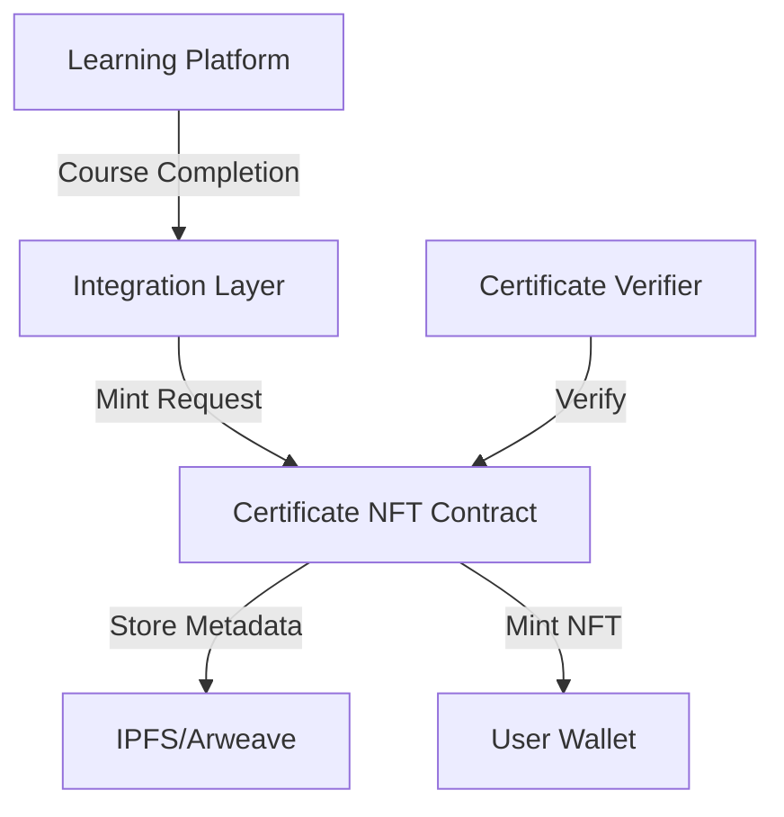

# 🎓 Course Completion Certificates as NFTs - Technical Research Document

## 📑 Table of Contents
1. [🏗️ Technical Architecture Overview](#technical-architecture-overview)
2. [⚡ Smart Contract Specifications](#smart-contract-specifications)
3. [📝 Metadata Schema](#metadata-schema)
4. [🔌 Integration Requirements](#integration-requirements)
5. [🔒 Security Considerations](#security-considerations)
6. [📋 Implementation Recommendations](#implementation-recommendations)

## 🏗️ Technical Architecture Overview

### 🧩 System Components

1. **Certificate NFT Contract**
   - Core Soroban smart contract implementing certificate functionality
   - Handles minting, verification, and ownership management
   - Implements access control for authorized issuers

2. **Learning Platform Integration Layer**
   - Bridge between learning platform and smart contract
   - Triggers certificate minting upon course completion
   - Manages user authentication and verification

3. **Metadata Storage System**
   - IPFS/Arweave for immutable certificate data storage
   - Contains detailed course and achievement information
   - Links to verification proofs and credentials

### 🔄 Architecture Flow



## ⚡ Smart Contract Specifications

### 📋 Core Contract Interface

```rust
pub trait CertificateNFT {
    // Admin functions
    fn initialize(e: Env, admin: Address) -> Result<(), Error>;
    fn add_issuer(e: Env, issuer: Address) -> Result<(), Error>;
    fn remove_issuer(e: Env, issuer: Address) -> Result<(), Error>;
    
    // Minting functions
    fn mint_certificate(
        e: Env,
        recipient: Address,
        course_id: String,
        metadata_uri: String,
    ) -> Result<u64, Error>;
    
    // Verification functions
    fn verify_certificate(e: Env, token_id: u64) -> Result<bool, Error>;
    
    // Metadata functions
    fn certificate_metadata(e: Env, token_id: u64) -> Result<CertificateMetadata, Error>;
}

#[derive(Clone, Debug, Serialize, Deserialize)]
pub struct CertificateMetadata {
    pub course_id: String,
    pub completion_date: u64,
    pub issuer: Address,
    pub metadata_uri: String,
    pub verification_proof: String,
}
```

### ✨ Key Features

1. **Role-Based Access Control**
   - Admin role for contract management
   - Issuer role for certificate minting
   - Student role for certificate ownership

2. **Certificate Lifecycle**
   - Minting upon course completion
   - Transfer restrictions (optional)
   - Verification mechanism
   - Metadata updates (if needed)

3. **Standards Compliance**
   - Soroban token interface implementation
   - W3C Verifiable Credentials compatibility
   - Metadata standards alignment

## 📝 Metadata Schema

### 📋 Certificate Metadata Structure

```json
{
  "schema_version": "1.0.0",
  "certificate": {
    "id": "unique_certificate_id",
    "type": "CourseCompletion",
    "issuanceDate": "ISO-8601-timestamp",
    "expirationDate": "ISO-8601-timestamp (optional)"
  },
  "achievement": {
    "courseId": "course_identifier",
    "courseName": "Course Title",
    "courseDescription": "Course Description",
    "skills": ["skill1", "skill2"],
    "completionDate": "ISO-8601-timestamp",
    "grade": "grade_value (optional)"
  },
  "issuer": {
    "id": "issuer_stellar_address",
    "name": "Institution Name",
    "url": "https://institution.com",
    "logo": "ipfs://logo_hash"
  },
  "recipient": {
    "id": "recipient_stellar_address",
    "name": "recipient_name (optional)",
    "publicKey": "recipient_public_key"
  },
  "verification": {
    "type": "SorobanVerification2024",
    "contractAddress": "contract_address",
    "proofHash": "verification_proof_hash",
    "transactionId": "stellar_transaction_id"
  }
}
```

## 🔌 Integration Requirements

### 🎓 Learning Platform Integration

1. **Event Triggers**
   ```rust
   pub struct CourseCompletionEvent {
       student_address: Address,
       course_id: String,
       completion_date: u64,
       grade: Option<String>,
       metadata: CertificateMetadata,
   }
   ```

2. **Integration Points**
   - Course completion verification
   - Student wallet authentication
   - Metadata generation and storage
   - Certificate minting trigger

### 🔌 API Endpoints (Integration Layer)

```rust
pub trait CertificateIntegration {
    async fn verify_course_completion(&self, student_id: &str, course_id: &str) -> Result<bool>;
    async fn prepare_certificate_metadata(&self, completion_event: CourseCompletionEvent) -> Result<String>;
    async fn mint_certificate(&self, student_address: Address, metadata_uri: &str) -> Result<u64>;
    async fn verify_certificate(&self, certificate_id: u64) -> Result<VerificationResponse>;
}
```

## 🔒 Security Considerations

### 🛡️ Smart Contract Security

1. **Access Control**
   - Role-based permissions
   - Multi-signature requirements for critical operations
   - Time-locks for contract upgrades

2. **Data Validation**
   - Input validation for all public functions
   - Metadata format verification
   - Address validation

3. **Upgrade Safety**
   - Contract upgrade mechanism
   - State migration strategy
   - Emergency pause functionality

### 📜 Certificate Security

1. **Immutability**
   - Immutable certificate data
   - Permanent metadata storage
   - Transparent verification process

2. **Privacy**
   - Optional private metadata
   - Selective disclosure
   - Data minimization

## 📋 Implementation Recommendations

### 🚀 Phase 1: Core Implementation

1. **Smart Contract Development**
   - Implement basic NFT functionality
   - Add certificate-specific features
   - Develop verification mechanism

2. **Metadata System**
   - Set up IPFS/Arweave integration
   - Implement metadata generation
   - Create verification proofs

3. **Integration Layer**
   - Develop event handlers
   - Create API endpoints
   - Implement authentication

### ⭐ Phase 2: Enhanced Features

1. **Advanced Verification**
   - Multi-party verification
   - Credential revocation
   - Expiration handling

2. **UI/UX Components**
   - Certificate viewer
   - Verification interface
   - Wallet integration

### 📈 Phase 3: Scaling & Optimization

1. **Performance Optimization**
   - Batch minting
   - Efficient storage
   - Gas optimization

2. **Monitoring & Analytics**
   - Event tracking
   - Usage metrics
   - Error monitoring

## 💻 Development Guidelines

### 📝 Smart Contract Best Practices

```rust
// Example contract structure
pub struct CertificateContract {
    admin: Address,
    issuers: Map<Address, bool>,
    certificates: Map<u64, CertificateMetadata>,
    next_token_id: u64,
}

impl CertificateContract {
    // Implementation details...
}
```

### 🧪 Testing Strategy

1. **🔍 Unit Tests**
   - Contract function testing
   - Access control verification
   - Error handling

2. **🔄 Integration Tests**
   - End-to-end certificate minting
   - Platform integration
   - Verification flow

3. **🔒 Security Tests**
   - Access control
   - Input validation
   - Upgrade safety

---